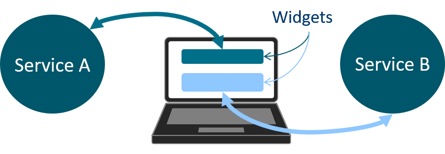

# Heureka!
## Collaboration based on services

Welcome to the microservice infrastructure that implements the basics for a full integrated collaboration suite fitting your needs! Using a collaboration software always binds your organization to the maintaining software vendor. Although the advent of Open Source software in the 1990s allows to share the burden of maintaining software, most organizations require such specifc collaboration features and the consideration of organizational internal knowledge and structures. Heureka! addresses this challenges by allowing you to setup your own environment and integrate features specifc to your organization that are implemented by software vendors you choose. You can bring together the expertize and experiences of different vendors without a large software project, but many small and distinct ones. You will be able to manage, improve and adjust your work environment as you need it!

If you are a software developer, you will see that you can use your existing expertize regarding technologies and technical environments to implement features requested by a client. The Heureka! architecture comes with an existing user management and solves problems as [user session management](../architecture/shared-session) or the [integration of UI elements in existing other microservices or existing UI elements in your new service](../architecture/dUIfc). Use the Heureka! architecture to responsible only for the services of your own development. Solutions for non-functional requirements or other services used by your client are maintained by others. Thus, you can stay focused and improve what really matters.

!!!! Getting started by pulling the [Heureka! CLI](https://github.com/SOTETO/heureka?target=_blank) and reading its [readme](https://github.com/SOTETO/heureka#readme?target=_blank) to setup your Heureka! environment! [How To create a microservice](../how-to/create-a-microservice) explains in detail the setup to start implementing your first microservice.

!!! **Required skills:** You need some basic web development knowledge about HTML, JS, CSS and HTTP. Furthermore, you will come in touch with RESTful webservices, Docker and Nginx web servers. *Implementing some webservices are great projects to learn about webservices, Docker and Nginx web servers!*

	

		
	

	

		Widgets allow you to compose the user interface of different elements from all running microservices. You will not have to implement the same user interface elements as already implemented by developers of other services. Just reuse it and support others with your own widgets!
	

	

		
Use the technology you know! You do <strong>not</strong> need to learn a programming language used by the already implemented microservices. Just basic skills in HTTP, HTML, CSS, Javascript, RESTful webservices are required.

	

	

		
	

